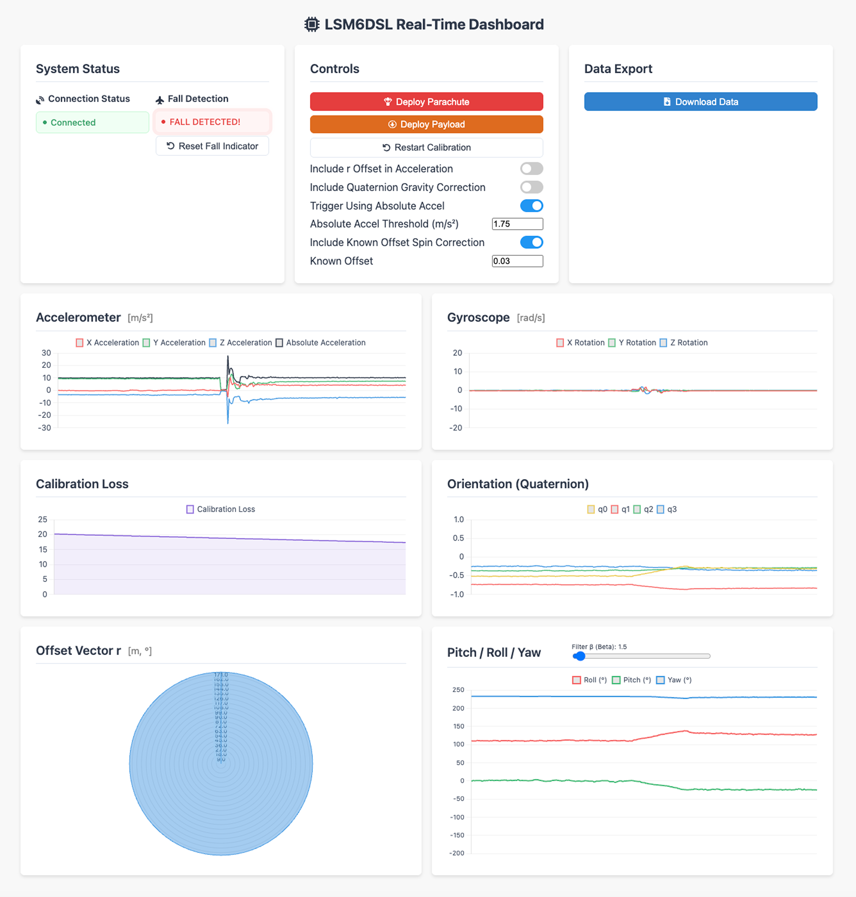

  

# Skyfall

**ESP32 firmware for automatic drone fall detection and parachute deployment.**  
Streams real-time telemetry—including quaternion orientation—via WebSocket to a live dashboard with full system control and on-the-fly algorithm tuning.

## UI Preview

  

## Real-World Test
[https://youtube.com/shorts/_UwGZIxDzJk](https://youtube.com/shorts/_UwGZIxDzJk)

## Firmware Options

### For Custom PCB "Ripcord"

**ESP32-S3 with LSM6DSL IMU**  
[Use this firmware](skyfall-firmware/skyfall-firmware-custom-PCB-ESP32-LSM6DSL-IMU.ino)

### For Development Board

**ESP32 Dev Module with MPU6050 IMU**  
[Use this firmware](skyfall-firmware/skyfall-firmware-ESP32-MPU6050-IMU.ino)

## Dashboard Setup

Regardless of the board you’re using:

1. Copy the contents of the [`skyfall-dashboard/`](skyfall-dashboard) folder into your `data/` folder.
2. Upload the data to your ESP32 using the SPIFFS uploader.

## Dependencies

### MadgwickRileyCustom
There are two options:

-   **Recommended:**  
    Copy the folder [`lib/MadgwickRileyCustom`](lib/MadgwickRileyCustom) directly into your Arduino `libraries` directory.

-   **Alternative:**
    1. Clone or download my fork of the MadgwickAHRS library:  
       [https://github.com/rcrym/MadgwickAHRS](https://github.com/rcrym/MadgwickAHRS)
    2. Rename the files to `MadgwickRileyCustom.cpp` and `MadgwickRileyCustom.h` to avoid conflicts with the standard version.
### Other Libraries
All other dependencies can be installed via the Arduino Library Manager.
